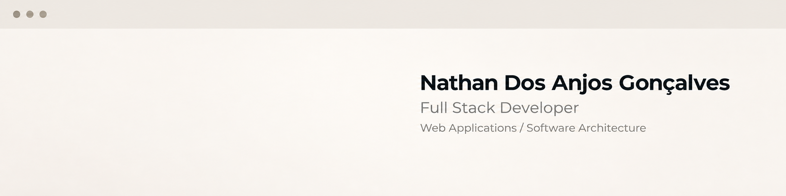

  

## Sobre Mim

Estudante de Sistemas de Informação com foco em Desenvolvimento Back-end e Engenharia de Software, com experiência prática no ambiente de tecnologia da TOTVS. Conhecimentos aplicados em APIs REST, autenticação JWT, arquitetura em camadas, microsserviços, Docker e integração contínua (CI/CD), com foco na construção de aplicações organizadas, testáveis e de fácil manutenção.

Experiência profissional em Quality Assurance, com atuação em testes funcionais e exploratórios, análise de requisitos, documentação de cenários e identificação de bugs. Essa vivência contribuiu para uma visão mais completa do ciclo de desenvolvimento de software e para uma atuação mais atenta à qualidade, confiabilidade e manutenção das soluções.

Em constante evolução na área de Desenvolvimento Back-end, com interesse em aprofundar conhecimentos em APIs, arquitetura de software e boas práticas de engenharia. Busco oportunidades em Desenvolvimento Back-end nas quais eu possa aplicar minha base técnica, aprender com desafios reais e contribuir para a construção e manutenção de sistemas escaláveis.
